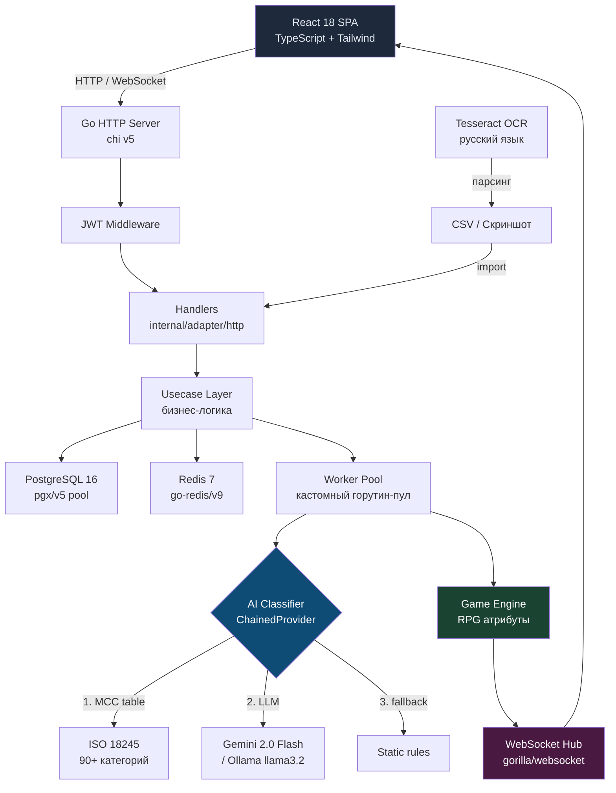

<div align="center">

# 💰 WealthCheck

### Fintech-платформа личных финансов с RPG-геймификацией

[](https://golang.org)
[](LICENSE)
[](https://postgresql.org)
[](https://redis.io)
[](https://react.dev)
[](https://docker.com)

</div>

---

Каждая трата прокачивает персонажа. Ресторан снижает ❤️ HP, спортзал повышает 💪 Strength, книги — 🧠 Intellect, развлечения — 🔮 Mana. Загрузи выписку из банка — и посмотри на свои финансы по-новому.

---

## ✨ Возможности

| | Фича | Описание |
|---|---|---|
| 🎮 | **RPG-геймификация** | Каждая транзакция влияет на атрибуты персонажа — HP, Mana, Strength, Intellect, Luck |
| 🤖 | **AI-классификация** | Гибридный подход: MCC-таблица (90+ категорий) → Gemini 2.0 Flash → Ollama llama3.2 → fallback |
| 📸 | **OCR скриншотов** | Tesseract офлайн — парсит скриншоты T-Bank, Сбер, кассовые чеки без внешних API |
| ⚡ | **Real-time обновления** | WebSocket: после обработки транзакции профиль обновляется мгновенно |
| 🔁 | **Идемпотентный импорт** | Повторная загрузка того же CSV безопасна — `ON CONFLICT DO NOTHING` + суммы в `int64` |
| 📊 | **Аналитика с кешем** | Redis TTL 1 час + составные индексы PostgreSQL — ускорение запросов ~4x |
| 🔐 | **JWT + Refresh tokens** | Refresh-токены в Redis, access — stateless JWT |
| 🐳 | **Одна команда** | `docker compose up --build` — полный стек за минуту |

---

## 🏗 Архитектура



---

## 🎮 Как работает RPG-механика

```
Транзакция → AI-классификация → Game Engine → WebSocket push → обновление профиля

Ресторан / фастфуд  →  ❤️  HP      −5
Спортзал / спорт    →  💪  Strength +3
Книги / курсы       →  🧠  Intellect +4
Развлечения         →  🔮  Mana     −3
Путешествия         →  🍀  Luck     +2
```

Каждое изменение атрибута логируется в `game_events` с привязкой к транзакции — полная история прокачки.

---

## 🤖 Гибридная классификация транзакций

```
Входящая транзакция
        │
        ▼
┌───────────────────┐
│  MCC-таблица      │  ← ISO 18245, 90+ категорий, детерминировано
│  (слой 1)         │     попадание → 100% точность, 0 мс overhead
└────────┬──────────┘
    miss │
        ▼
┌───────────────────┐
│  Gemini 2.0 Flash │  ← LLM fallback для нестандартных MCC
│  (слой 2)         │
└────────┬──────────┘
    fail │
        ▼
┌───────────────────┐
│  Ollama llama3.2  │  ← локальный LLM, без квот и внешних зависимостей
│  (слой 3)         │
└────────┬──────────┘
    fail │
        ▼
┌───────────────────┐
│  Static fallback  │  ← никогда не блокирует pipeline
└───────────────────┘
```

---

## ⚡ Ключевые технические решения

**Идемпотентный импорт**
```sql
INSERT INTO transactions (account_id, external_id, amount, ...)
VALUES (...)
ON CONFLICT (account_id, external_id) DO NOTHING;
-- Повторная загрузка того же CSV — безопасна
-- Суммы в int64 (копейки) — никаких float-ошибок
```

**Redis-кеш аналитики**
```
Cache key: analytics:{account_id}:{period_days}
TTL: 1 час
Cache miss → PostgreSQL
  INDEX (account_id, occurred_at DESC)
  INDEX (account_id, clean_category)
Ускорение: ~4x
```

**OCR без внешних API**
```
Tesseract + ru.traineddata → встроен в Docker-образ
Парсит: T-Bank, Сбербанк, кассовые чеки
Полностью офлайн, без квот, бесплатно
```

---

## 🚀 Быстрый старт

```bash
git clone https://github.com/GrishaMelixov/WealthCheck
cd WealthCheck

cp .env.example .env
# Заполнить JWT_SECRET и пароли БД

docker compose up --build
# → http://localhost:8080
```

---

## ⚙️ Конфигурация

| Переменная | Описание | Default |
|---|---|---|
| `DATABASE_URL` | PostgreSQL DSN | — |
| `REDIS_URL` | Redis DSN | — |
| `JWT_SECRET` | 32+ байт случайная строка | — |
| `PROVIDER` | `gemini` / `ollama` / `chained` | `chained` |
| `GEMINI_API_KEY` | Опционально, для AI-классификации | — |
| `GEMINI_MODEL` | Модель Gemini | `gemini-2.0-flash` |
| `WORKER_COUNT` | Размер горутин-пула | `10` |
| `QUEUE_SIZE` | Размер очереди задач | `500` |

---

## 🌐 API

```
POST  /auth/register
POST  /auth/login
POST  /auth/refresh
POST  /auth/logout

GET   /api/v1/accounts
POST  /api/v1/transactions/import        # CSV (Tinkoff / Сбер формат)
GET   /api/v1/transactions?account_id=&limit=&offset=
POST  /api/v1/receipts/parse             # скриншот → транзакции (Tesseract OCR)
GET   /api/v1/analytics/summary?account_id=&days=30
GET   /api/v1/profile                    # RPG-профиль персонажа
GET   /api/v1/quests                     # активные квесты
GET   /ws?token=                         # WebSocket (real-time пуши)
GET   /health
```

---

## 🧪 Тестирование

```bash
# Unit-тесты (~87% покрытие core business logic)
go test ./internal/usecase/...

# Интеграционные тесты (testcontainers-go — реальный PostgreSQL в Docker)
go test -tags=integration ./internal/integration/... -v
```

Покрыты юнит-тестами: `game_engine`, `transaction_import`, `register/login/logout/refresh`, `get_quests`, `get_profile`

Покрыты интеграционными: идемпотентность импорта, обновление `game_profiles` через engine, аналитические запросы

---

## 📁 Структура репозитория

```
WealthCheck/
├── cmd/server/               # Точка входа, DI вручную
├── internal/
│   ├── domain/               # Сущности: User, Account, Transaction, GameProfile, GameEvent
│   ├── usecase/              # Бизнес-логика (без зависимостей от фреймворков)
│   │   └── port/             # Интерфейсы репозиториев и провайдеров
│   ├── adapter/
│   │   ├── http/             # Хендлеры, JWT middleware, rate limit
│   │   ├── postgres/         # Реализация репозиториев (pgx/v5)
│   │   ├── ai/               # Gemini, Ollama, Chained, MCC-таблица
│   │   └── websocket/        # WebSocket hub (gorilla/websocket)
│   ├── infrastructure/
│   │   ├── auth/             # JWT сервис, Redis token store
│   │   ├── cache/            # Redis подключение
│   │   └── worker/           # Горутин-пул для async обработки
│   └── integration/          # Интеграционные тесты (testcontainers-go)
├── migrations/               # 7 SQL-миграций (embedded через go:embed)
├── frontend/                 # React 18 + TypeScript + Tailwind v3
├── Dockerfile                # 3-stage: Node → Go → Alpine+Tesseract
├── docker-compose.yml
└── .env.example
```

---

## 🛠 Стек

**Backend:** Go 1.25 · chi v5 · pgx/v5 · go-redis/v9 · gorilla/websocket · golang-jwt · golang-migrate · uber-go/zap · testcontainers-go

**AI/ML:** Gemini 2.0 Flash · Ollama llama3.2 · Tesseract OCR (русский)

**Frontend:** React 18 · TypeScript · Vite · Tailwind CSS v3 · iOS 26 Liquid Glass design

**Infrastructure:** Docker · Docker Compose · PostgreSQL 16 · Redis 7

---

<div align="center">

Сделано с 🖤 на Go · [MIT License](LICENSE)

</div>
